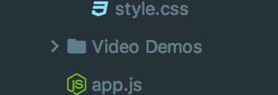

# Control with URL

In this example the user can search in either datacube or dashboard view to update an iframe with a new Imply-UI URL that applies a page filter. In datacube view the user also has the option of selecting a dimension from a dropdown menu to generate new URL and update the iframe. 


To run: 

`npm install`

`npm start`

## Overview

The purpose of this example is to show how you can update the contents of an iframe by updating its link using the full hash of an essence. When the user clicks go, or updates the dimension, the setUrl function is called.
SetUrl takes the user input and creates an essence. This Essence contains the information that Imply needs to update the UI with filtered results. This input is then passed as a parameter to the toFullHash function.
The essence is then converted to a base 64 encoded string using the lz-String library and formatted to work in a URL. This hash when added to the URL following `http://localhost:9095/pivot/c/` for dashboards or `http://localhost:9095/pivot/d/` for data cubes and used to update the iframe to reflect the applied filter. 

## Getting an App token
- Download Imply quickstart and follow the quick start guide:

  https://docs.imply.io/on-prem/quickstart

- Navigate to imply-x.x.x/conf-quickstart/pivot/config.yaml and add `enableApiEndpoint: true`

  

- Open Localhost:9095 and from the side menu navigate to settings. Under settings select API tokens and click on new token to generate an API token.

  
  
## Import settings 
To use the exact same set up of Imply for this demo you will need to import the same app settings: 

Go to your running Imply application and navigate to settings > advanced and scroll to bulk imports. Click on import settings. 


Copy the app settings object from this project and click import. 

## View essence in Imply Ui

To view the essence of a request for either a datacube or dashboard open inspect element in your prefered view. To do this, in Chrome navigate to the desired page and press F12 or right click and select inspect element. 


Open the network tab and apply your filter like normal. 


Under XHR and fetch you should see a request named register, open the headers tab of this request. Scroll to the bottom section called Request Payload. In this section you should be able to see and expand the essence of the operation you just preformed. 


## Configuring the Essence

The essence contains the filters you are searching by. The easiest way to configure the essence is the view the calls the Imply makes to `/pivot/mkurl/register` and copy the essence. To view the essence configuration in Imply, add a filter to your data cube or dashboard and look at the payload of register under the network tab of inspect element.

```
const essence = {
    "dataCube": "druid_wikipedia",
    "filter": {
      "clauses": [
        {
          "dimension": "__time",
          "dynamic": {
            "op": "timeRange",
            "operand": {
              "op": "ref",
              "name": "m"
            },
            "duration": "P1D",
            "step": -1
          }
        },
        {
          "dimension": "page",
          "action": "overlap",
          "exclude": false,
          "values": {
            "elements": [String(req.body.filterValue)]//User Inputs updates filter
          },
          "setType": "STRING",
        }
      ]
    },
    "timezone": "Etc/UTC",
    "splits": [],
    "pinnedDimensions": [],
    "selectedMeasures": ["count"],
    "settingsVersion": null,
    "visualization": "totals"
  }
```


## Additional Resources
  
- Demo Videos

  
