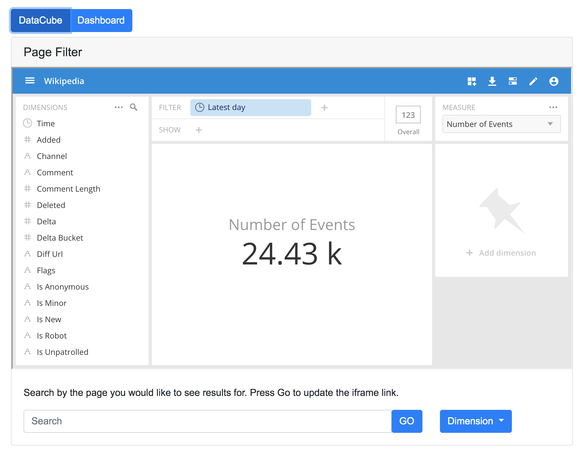
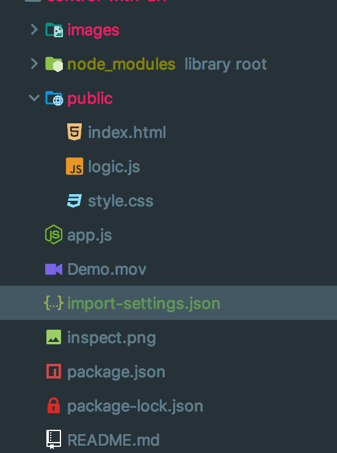

# Control with URL

In this example the user can search in either data cube or dashboard view to update an iframe by sending a post message to Pivot. In data cube view the user also has the option of selecting a dimension from a dropdown menu to send a post message and update the iframe.




To run:

`npm start`

## Overview

The purpose of this example is to show how you can update an iframe sending a post message to Pivot. When the user clicks the go button or selects a value from the dropdown menu whatever they have entered is passed as a parameter to the sendPostMessage function.
SendPostMessage configures the essence as well as a data object that contains information about the action you want to preform. This data object is sent to the post message receiver in Pivot and the essence updates. Additional operations have been documented below.

## Import settings
To use the exact same set up of Imply for this demo you will need to import the same app settings:

Go to your running Imply application and navigate to settings > advanced and scroll to bulk imports. Click on import settings.


Copy the app settings object from this project and click import.

## View essence in Imply Ui

To view the essence of a request for either a datacube or dashboard open inspect element in your prefered view. To do this, in Chrome navigate to the desired page and press F12 or right click and select inspect element.


Open the network tab and apply your filter like normal.


Under XHR and fetch you should see a request named register, open the headers tab of this request. Scroll to the bottom section called Request Payload. In this section you should be able to see and expand the essence of the operation you just preformed.


###### x-imply-api-token:

This is a header for the request, and should be set to the API token generated in your local Imply UI

`"x-imply-api-token":"1a1b1cf8-fc83-495d-94d9-27f22836b81b"`

###### Datacube or Dashboard:

This is the data source you are targeting. In Imply UI if you select a data source the portion of the URL directly after the `/d/` will be the datacube name. For Dashboard the name is the portion directly after the '/c/'
You can also easily find this by viewing the essence in Imply UI.

`"dataCube": "druid_wikipedia"`

`"dashboard": "7c9e"`

###### Sending an action

In your post message you should send an object with values for: view, name, action and parameters.

View must be a string with the value of either 'dashboard' or 'dataCube'
ex)  `data.view = 'dashboard`

Name is the unique name of the data cube or dashboard you are targeting, for data cubes this is the value following the `/d/ ` in the Imply UI URL and `/c/ ` for dashboards
ex) `data.name = 909c`

Action is the matching action of the clicker in Imply ui and should be a single sting:
ex) `data.action = 'changeEssence'`

Parameters will be the arguments of the function you are calling in imply ui

An Example postMessage would look like this:
```
const data = {
    view: 'dataCube',
    name: 'bdec_23',
    action: 'changeTimezone',
    parameters: 'Etc/UTC'
  }
  
const url = 'http://locahost:9095'

document.getElementById('pivot').contentWindow.postMessage(data, url)
```

###### Dashboard Actions
changeTimezone:
Updates the timezone of the Dashboard. Parameters should be a string containing the timezone name.

supported timezones: 'America/Argentina/Buenos_Aires',
'America/Chicago',
'America/Denver',
'America/Juneau',
'America/Los_Angeles',
'America/Mexico_City',
'America/New_York',
'America/Phoenix',
'America/Yellowknife',
'Asia/Hong_Kong',
'Asia/Jerusalem',
'Asia/Kathmandu',
'Asia/Seoul',
'Asia/Shanghai',
'Asia/Tokyo',
'Australia/Sydney',
'Etc/UTC',
'Europe/London',
'Europe/Paris',
'Pacific/Guam'


Ex)

```
data= {
view: 'dashboard'
name: '909c'
action: 'changeTimezone'
parameters: 'Etc/UTC' // TimeZone
}
```


changeFilter:
The filter controls what data is visible to the user. The easiest way to configure a filter is to look at the Essence of your data cube or dashboard and copy the filter.

```
data= {
view: 'dashboard'
name: '909c'
action: 'changeFilter'
parameters: {
  "clauses":[{
    "dimension":"channel",
    "action":"overlap",
    "values":{"setType":"STRING","elements":["#fr.wikipedia"]}
  },
  {
    "dimension":"countryIsoCode",
    "action":"overlap",
    "values":{"setType":"STRING","elements":["IT"]}
    ,"exclude":false}]
   }
}
```

changeSelectedPage:
Navigates to the selected page. The parameter should be set to the page name of the page you would like to select. The easiest way to find the page name is to look for the selected page value in the essence in Imply UI.

```
data= {
view: 'dashboard'
name: '909c'
action: 'changeSelectedPage'
parameters: 'page94f3'
}
```

changeHighlight:
Updates the highlight. Parameters requires the updated highlight. The easiest way to configure this is to look at the essence in impy ui.
```
data= {
  view: 'dashboard'
  name: '909c'
  action: 'changeHighlightFor'
  parameters: {
    "delta":{"clauses":[{
      "dimension":"channel",
        "action":"overlap",
        "values":{
          "setType":"STRING",
          "elements":["#uk.wikipedia"]
        }
    }]},
    "measure":"count"
  }
}
```

changeSelectedMeasures:
Updates the measure of the dashboard. Parameters should be an array with the name of the measure you would like to select. Selected measures can also be seen in the Essence of Imply UI.

```
data= {
view: 'dashboard'
name: '909c'
action: 'changeSelectedMeasures'
parameters: [{name: "cd_user_unique"}]
}
```

acceptHighlight:
Allows dashboard to accept highlight, requires no parameters.
```
data= {
view: 'dashboard'
name: '909c'
action: 'acceptHighlight'
}
```

changeCompare:
Updates compare value. Requires a compare object, this can be seen by looking at the Imply UI essence.
```
data= {
view: 'dashboard'
name: '909c'
action: 'changeCompare'
parameters: [{name: "cd_user_unique"}]
}
```

dropHighlight:
Drops Highlight, no parameters required.
```
data= {
view: 'dashboard'
name: '909c'
action: 'dropHighlight'
}
```

invertHighlight:
Inverts Highlight, no parameters required.

```
data= {
view: 'dashboard'
name: '909c'
action: 'invertHighlight'
}
```

triggerExplain:
Triggers explain, no parameters required.

```
data= {
view: 'dashboard'
name: '909c'
action: 'triggerExplain'
}
```

ChangeExplain:
Updates explain, take a parameter of ExplainType.

Explaintypes: `'trend'` , `'compare'` . `'breakdown'`

```
data= {
view: 'dashboard'
name: '909c'
action: 'triggerExplain'
parameters: trend'
}
```

removeExplain:
Removes explain, no parameters required.

```
data= {
view: 'dashboard'
name: '909c'
action: 'removeExplain'
}
```

changeEssence:
Changes the essence which provides the configuration of the essence the easiest way to configure the essence is to configure your dashboard in Imply UI and copy the essence
```
data= {
view: 'dashboard'
name: '909c'
action: 'changeEssence'
parameters: {
  "dashboard": "b4d0",
  "filter": {
    "clauses": [
      {
        "dimension": "page",
        "action": "overlap",
        "exclude": false,
        "values": {
          "elements": [message]//User Inputs updates filter
        },
        "setType": "STRING",
      }
    ]
  },
  "timezone": "Etc/UTC",
  "selectedMeasures": [],
  "selectedPage": "page"
  }
}
```


###### Data Cube Actions

changeTimezone:
Updates the timezone of the Dashboard. Parameters should be a string containing the timezone name.

supported timezones: 'America/Argentina/Buenos_Aires',
'America/Chicago',
'America/Denver',
'America/Juneau',
'America/Los_Angeles',
'America/Mexico_City',
'America/New_York',
'America/Phoenix',
'America/Yellowknife',
'Asia/Hong_Kong',
'Asia/Jerusalem',
'Asia/Kathmandu',
'Asia/Seoul',
'Asia/Shanghai',
'Asia/Tokyo',
'Australia/Sydney',
'Etc/UTC',
'Europe/London',
'Europe/Paris',
'Pacific/Guam'
```
data= {
view: 'dataCube'
name: 'druid_wikipedia'
action: 'changeTimezone'
parameters: ''
}
```

changeFilter:
The filter controls what data is visible to the user. The easiest way to configure a filter is to look at the Essence of your data cube or dashboard and copy the filter.

```
data= {
view: 'dataCube'
name: 'druid_wikipedia'
action: 'changeFilter'
parameters:
 parameters: {
  "clauses": [{
    "dimension":"__time",
    "dynamic":{"op":"timeRange",
      "operand":{"op":"ref","name":"m"},
      "duration":"P1D","step":-1}
      },
    {"dimension":"deltaBucket",
      "action":"overlap",
      "values":{"setType":"STRING","elements":["400.0"]},
      "exclude":false
    }]
}
```

updateWithNewSplits:
```
data= {
view: 'dataCube'
name: 'druid_wikipedia'
action: 'updateWithNewSplits'
parameters: ''
}
```

changeSplits:
Changes the dimensions of the data cube. Requires parameters.splits and perameters.hint. You can see splits by looking at the essence of the configured data cube in Imply. Hint must be of type visualization hint.

hint:  `'none'` or `'keep-current'` or `'ignore-current'`

```
data= {
  view: 'dataCube'
  name: 'druid_wikipedia'
  action: 'changeSplit'
  parameters: {
    hint:'ignore-current',
    splits: [{
      "dimension":"isMinor",
      "sortType":"measure",
      "direction":"descending"
     }]
  }
}
```

addSplit:
Add an additional Dimension to current the current dimensions. Parameters should be the single new split object, this is easily visible in the Essence in Imply UI.

```
data= {
  view: 'dataCube'
  name: 'druid_wikipedia'
   action: 'addSplit'
   parameters: {
     "dimension":"isRobot",
     "sortType":"measure",
     "direction":"descending"
   }
 }
```

removeSplit:
Removes one dimension from the data cube. Parameters should be the single new split object, this is easily visible in the Essence in Imply UI.
```
data= {
  view: 'dataCube'
  name: 'druid_wikipedia'
   action: 'addSplit'
   parameters: {
     "dimension":"isRobot",
     "sortType":"measure",
     "direction":"descending"
   }
 }

```

summonVisualization:
Updates how the data within the data cube is displayed. Perameters should be set to a BaseManifest.

BaseManifest: `{name: string, title: string}`

```
data= {
view: 'dataCube'
name: 'druid_wikipedia'
action: 'summonVisualization'
parameters: ''
}
```

pin:
Pins a dimension to the side of the data cube. Parameters requires both a Dimension and the index of the Dimension.
```
data= {
  view: 'dataCube'
  name: 'druid_wikipedia'
  action: 'pin'
  parameters: {
    dimension: {
         "name":"isRobot",
         "title":"Is Robot",
         "formula":"$isRobot",
         "type":"STRING"
    },
       index: 0 
    }
  }
}
```

unpin:
Unpins a dimension. Parameters requires a dimension.
```
data= {
  view: 'dataCube'
  name: 'druid_wikipedia'
  action: 'unpin'
  parameters:{
    "name":"isRobot",
    "title":"Is Robot",
    "formula":"$isRobot",
    "type":"STRING"
  }
}
```

movePinnedDimension:
Moves a pinned dimension to a new index Parameters requires a dimension and the new index where that dimension will appear.
```
data= {
  view: 'dataCube'
  name: 'druid_wikipedia'
  action: 'pin'
  parameters: {
    dimension: {
         "name":"isRobot",
         "title":"Is Robot",
         "formula":"$isRobot",
         "type":"STRING"
    },
    index: 0 
  }
}
```

changeSelectedMeasures:
Updates the measure of the data cube. Parameters should be an array with the name of the measure you would like to select. Selected measures can also be seen in the Essence of Imply UI.
```
data= {
view: 'dataCube'
name: 'druid_wikipedia'
action: 'changeSelectedMeasures'
parameters:  [{name: "cd_user_unique"}]
}
```

changeAuxiliaryMeasures:
Updates the auxiliary measures of the data cube. Perameters should be an array with the name of the measure you would like to select. Selected measures can also be seen in the Essence of Imply UI.

```
data= {
view: 'dataCube'
name: 'druid_wikipedia'
action: 'changeSelectedMeasures'
parameters:  [{name: "cd_user_unique"}]
}
```

toggleHavingFilter:
Toggle filter, requires no parameters.
```
data= {
view: 'dataCube'
name: 'druid_wikipedia'
action: 'toggleHavingFilter'
}
```

changeHavingFilter:
```
data= {
view: 'dataCube'
name: 'druid_wikipedia'
action: 'changeHavingFilter'
parameters: ''
}
```

toggleCompare:
Toggle compare, requires no parameters.

```
data= {
view: 'dataCube'
name: 'druid_wikipedia'
action: 'toggleCompare'
parameters: ''
}
```

changeCompare:
Updates compare value. Requires a compare object, this can be seen by looking at the Imply UI essence.
```
data= {
view: 'dataCube'
name: 'druid_wikipedia'
action: 'changeCompare'
parameters: [{name: "cd_user_unique"}]
}
```

changeHighlight:
Updates the highlight. Parameters requires the updated highlight. The easiest way to configure this is to look at the essence in impy ui.


```
data= {
  view: 'dataCube'
  name: 'druid_wikipedia'
  action: 'changeHighlight'
  parameters: {
   "delta":{"clauses":[{
     "dimension":"channel",
       "action":"overlap",
       "values":{
         "setType":"STRING",
         "elements":["#uk.wikipedia"]
       }
   }]},
   "measure":"count"
  }
}
```

acceptHighlight:
Allows data cube to accept highlight, requires no parameters.

```
data= {
view: 'dataCube'
name: 'druid_wikipedia'
action: 'acceptHighlight'
}
```

triggerExplain:
Tiggers Explain requires, no parameters. To use this feature you must have experimental features enables

```
data= {
view: 'dataCube'
name: 'druid_wikipedia'
action: 'triggerExplain'
}
```

ChangeExplain:
updates explain, take a parameter of ExplainType.

Explaintypes: `'trend'` , `'compare'` . `'breakdown'`

```
data= {
view: 'dataCube'
name: 'druid_wikipedia'
action: 'changeExplain'
parameters: 'trend'
}
```

removeExplain:
Removes current explain requires, no parameters. To use this feature you must have experimental features enables

```
data= {
view: 'dataCube'
name: 'druid_wikipedia'
action: 'removeExplain'
parameters: ''
}
```

changeEssence:
Changes the essence which provides the configuration of the essence the easiest way to configure the essence is to configure your dashboard in Imply UI and copy the essence

```
data= {
view: 'dataCube'
name: 'druid_wikipedia'
action: 'changeEssence'
parameters: {
  "dataCube": "wikipedia",
    "filter": {
    "clauses": [
      {
        "dimension": "__time",
        "dynamic": {
          "op": "timeRange",
          "operand": {
            "op": "ref",
            "name": "m"
          },
          "duration": "P1D",
          "step": -1
        }
      },
      {
        "dimension": "page",
        "action": "overlap",
        "exclude": false,
        "values": {
          "elements": [message]//User Inputs updates filter
        },
        "setType": "STRING",
      }
    ]
  },
  "timezone": "Etc/UTC",
    "splits": splits,
    "pinnedDimensions": [],
    "selectedMeasures": ["count"],
    "settingsVersion": null,
    "visualization":  splits.length ? "table":"totals"
  }
}
```


###### Essence:

The essence contains the filters you are searching by. To view the configuration add a filter in the ui and look at the payload of register under the network tab of inspect element.

```
const essence = {
    "dataCube": "druid_wikipedia",
    "filter": {
      "clauses": [
        {
          "dimension": "__time",
          "dynamic": {
            "op": "timeRange",
            "operand": {
              "op": "ref",
              "name": "m"
            },
            "duration": "P1D",
            "step": -1
          }
        },
        {
          "dimension": "page",
          "action": "overlap",
          "exclude": false,
          "values": {
            "elements": [String(req.body.filterValue)]//User Inputs updates filter
          },
          "setType": "STRING",
        }
      ]
    },
    "timezone": "Etc/UTC",
    "splits": [],
    "pinnedDimensions": [],
    "selectedMeasures": ["count"],
    "settingsVersion": null,
    "visualization": "totals"
  }
```


## Additional Resources

- Generating links into Imply documentation

  https://docs.imply.io/on-prem/special-ui-features/generating-links-into-imply

- postMessage MDN documentation

  https://developer.mozilla.org/en-US/docs/Web/API/Window/postMessage

- Demo Videos

 
