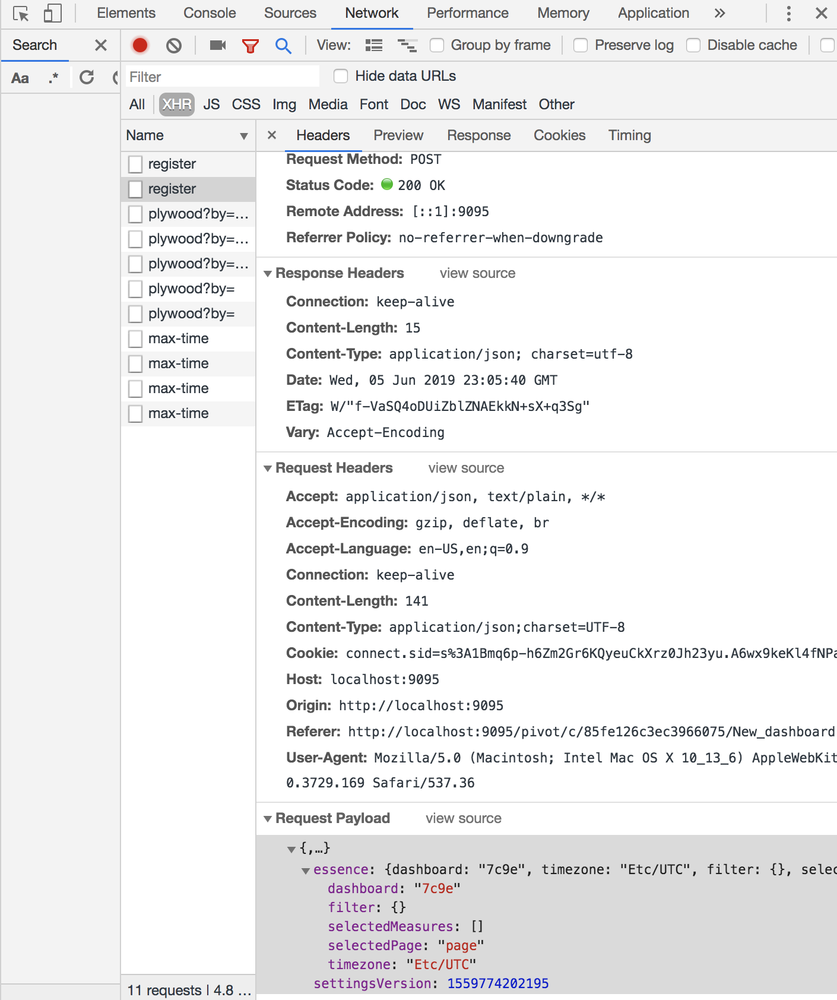

# Control with URL

In this example the user can search in either datacube or dashboard view to update an iframe with a new Imply-UI URL that applies a page filter. In datacube view the user also has the option of selecting a dimension from a dropdown menu to generating a new Url and update the iframe. 


To run: 

`npm install`

`npm start`

## Overview

The purpose of this example is to show how you can update an iframe by updating a URL based on user input. When the user clicks the go button or selects a value from the dropdown menu whatever they have entered is passed as a parameter to the setUrl function of the respective view.
SetUrl then makes a fetch request to app.js with the user input as the body of the request. In app.js the header and domain are configured and the user input is added as an element of the filters in essence. Axios is then used to make a post request that returns the new URL to logic.js.
If the request has been successful and returns a URL then the src of the iframe will update. Notably, if a URL is not returned or if the user does not search anything, then the URL with be set as the default URL.

## Getting an App token
- Download Imply quickstart and follow the quick start guide:

  https://docs.imply.io/on-prem/quickstart

- Navigate to imply-x.x.x/conf-quickstart/pivot/config.yaml and add `enableApiEndpoint: true`

  

- Open Localhost:9095 and from the side menu navigate to settings. Under settings select API tokens and click on new token to generate an API token.

  
  
## Import settings 
To use the exact same set up of Imply for this demo you will need to import the same app settings: 

Go to your running Imply application and navigate to settings > advanced and scroll to bulk imports. Click on import settings. 


Copy the app settings object from this project and click import. 

## View essence in Imply Ui

To view the essence of a request for either a datacube or dashboard open inspect element in your prefered view. To do this, in Chrome navigate to the desired page and press F12 or right click and select inspect element. 


Open the network tab and apply your filter like normal. 


Under XHR and fetch you should see a request named register, open the headers tab of this request. Scroll to the bottom section called Request Payload. In this section you should be able to see and expand the essence of the operation you just preformed. 


## Configuring a request

You can generate links that open to specific views to update iframe by POSTing to `http://localhost:9095/api/v1/mkurl`

Requests to Imply UI requires three main components to be configured:

###### x-imply-api-token:

This is a header for the request, and should be set to the API token generated in your local Imply UI

`"x-imply-api-token":"1a1b1cf8-fc83-495d-94d9-27f22836b81b"`

###### Datacube or Dashboard:

This is the data source you are targeting. In Imply UI if you select a data source the portion of the URL directly after the `/d/` will be the datacube name. For Dashboard the name is the portion directly after the '/c/'
You can also easily find this by viewing the essence in Imply UI.

`"dataCube": "druid_wikipedia"`

`"dashboard": "7c9e"`

###### Essence:

The essence contains the filters you are searching by. To view the configuration add a filter in the ui and look at the payload of register under the network tab of inspect element.

```
const essence = {
    "dataCube": "druid_wikipedia",
    "filter": {
      "clauses": [
        {
          "dimension": "__time",
          "dynamic": {
            "op": "timeRange",
            "operand": {
              "op": "ref",
              "name": "m"
            },
            "duration": "P1D",
            "step": -1
          }
        },
        {
          "dimension": "page",
          "action": "overlap",
          "exclude": false,
          "values": {
            "elements": [String(req.body.filterValue)]//User Inputs updates filter
          },
          "setType": "STRING",
        }
      ]
    },
    "timezone": "Etc/UTC",
    "splits": [],
    "pinnedDimensions": [],
    "selectedMeasures": ["count"],
    "settingsVersion": null,
    "visualization": "totals"
  }
```


## Additional Resources

- Generating links into Imply documentation

  https://docs.imply.io/on-prem/special-ui-features/generating-links-into-imply
  
-Demo Videos
  
