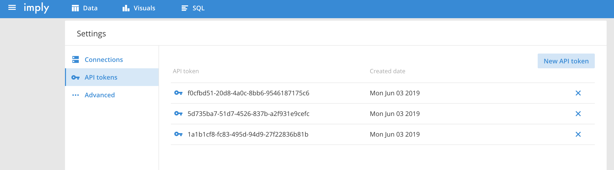

# Control with URL

In this example upon clicking the go button, the user input will be used to generate a new URL from Imply that applies a page filter.


To run: 
`npm install`

`npm start`

## Overview

The purpose of this example is to show how you can update an iframe using updating a URL based on user generated search parameters. When the user clicks the go button what ever they have typed is passed as a perimeter to the setUrl function.
SetUrl then makes a fetch request to app.js with the user input as the body of the request. In app.js the header and domain are configured and the user input is added as an element of the filters in essence. Axios is then used to make a post request that returns the new URL to logic.js.
If the request has been successful and returns a URL then the src of the iframe will update. Notably, if a URL is not returned or if the user does not search anything, then the URL with be set as the default URL.

## Getting an App token

- Download Imply quickstart and follow the quick start guide:

  https://docs.imply.io/on-prem/quickstart

- Navigate to imply-x.x.x/conf-quickstart/pivot/config.yaml and add `enableApiEndpoint: true`

  

- Open Localhost:9095 and from the side menu navigate to settings. Under settings select API tokens and click on new token to generate an API token.

  

## Configuring a request

You can generate links that open to specific views to update iframe by POSTing to `http://localhost:9095/api/v1/mkurl`

Requests to Imply UI requires three main components to be configured:

###### x-imply-api-token:

This is a header for the request, and should be set to the API token generated in your local Imply UI

`"x-imply-api-token":"1a1b1cf8-fc83-495d-94d9-27f22836b81b"`

###### Datacube:

This is the data source you are targeting. In Imply UI if you select a data source the portion of the URL directly after the `/d/` will be the datacube name.

`"dataCube": "druid_wikipedia"`

###### Essence:

The essence contains the filters you are searching by. To view the configuration add a filter in the ui and look at the payload of register under the network tab of inspect element.

```
const essence = {
    "dataCube": "druid_wikipedia",
    "filter": {
      "clauses": [
        {
          "dimension": "__time",
          "dynamic": {
            "op": "timeRange",
            "operand": {
              "op": "ref",
              "name": "m"
            },
            "duration": "P1D",
            "step": -1
          }
        },
        {
          "dimension": "page",
          "action": "overlap",
          "exclude": false,
          "values": {
            "elements": [String(req.body.filterValue)]//User Inputs updates filter
          },
          "setType": "STRING",
        }
      ]
    },
    "timezone": "Etc/UTC",
    "splits": [],
    "pinnedDimensions": [],
    "selectedMeasures": ["count"],
    "settingsVersion": null,
    "visualization": "totals"
  }
```


## Additional Resources

- Generating links into Imply documentation

  https://docs.imply.io/on-prem/special-ui-features/generating-links-into-imply
